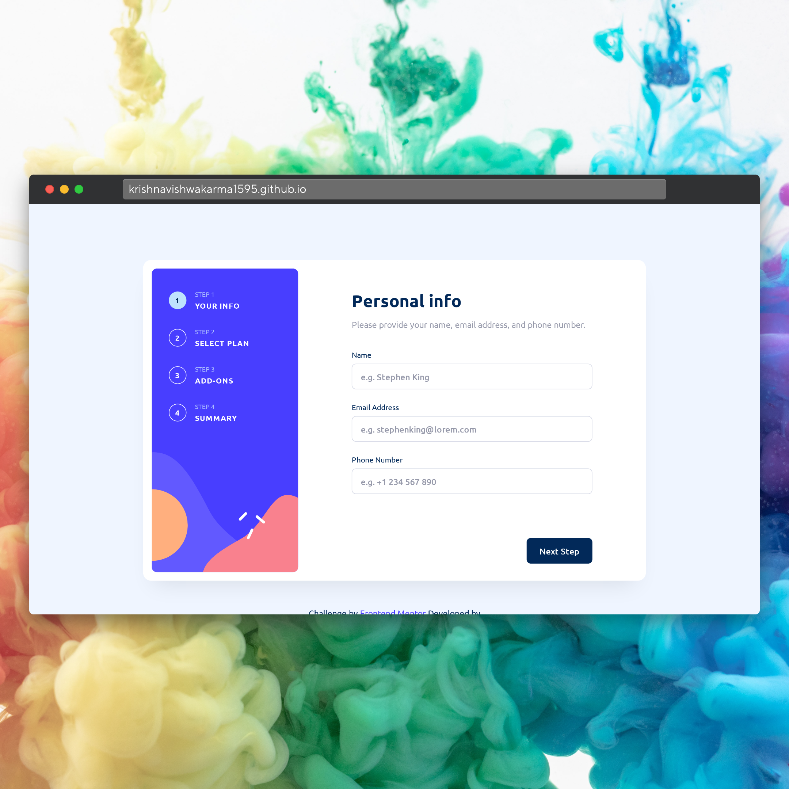
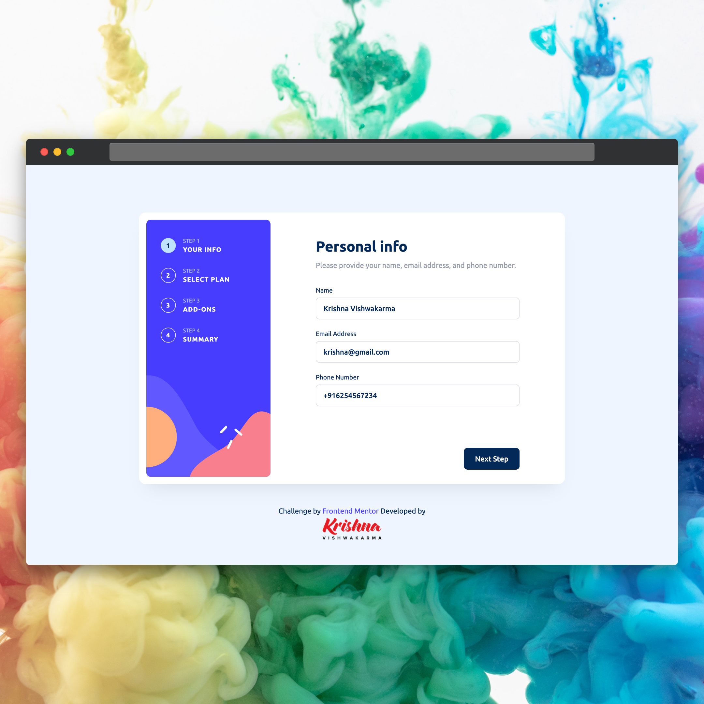
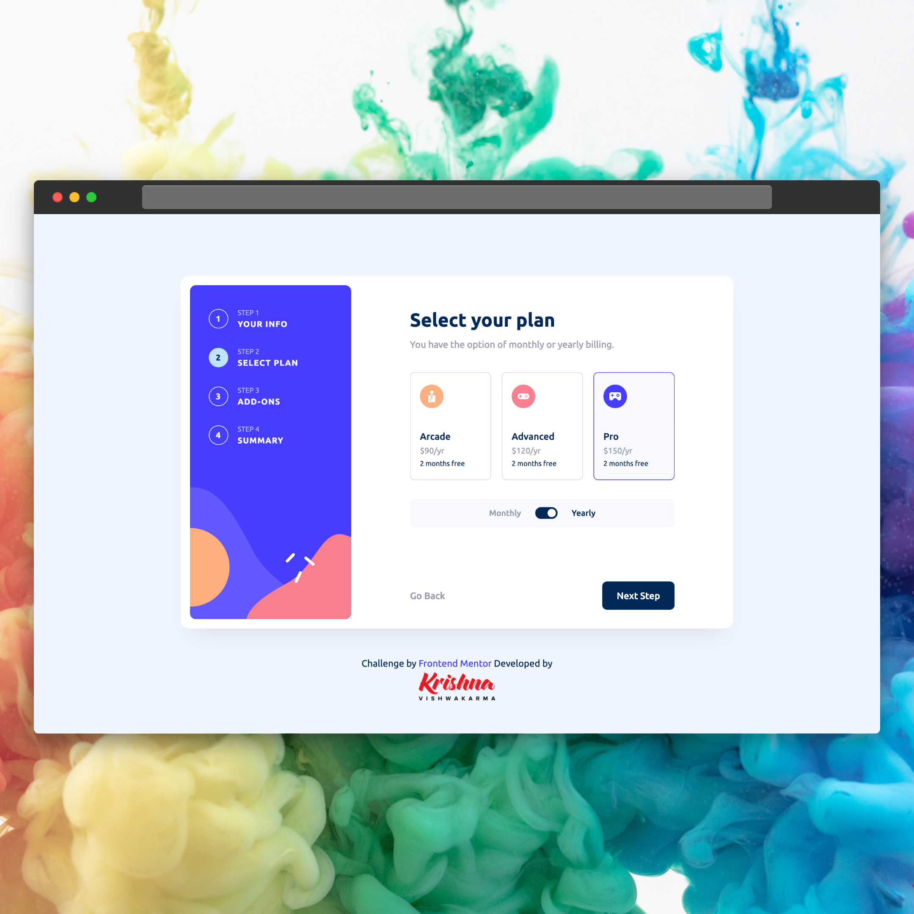
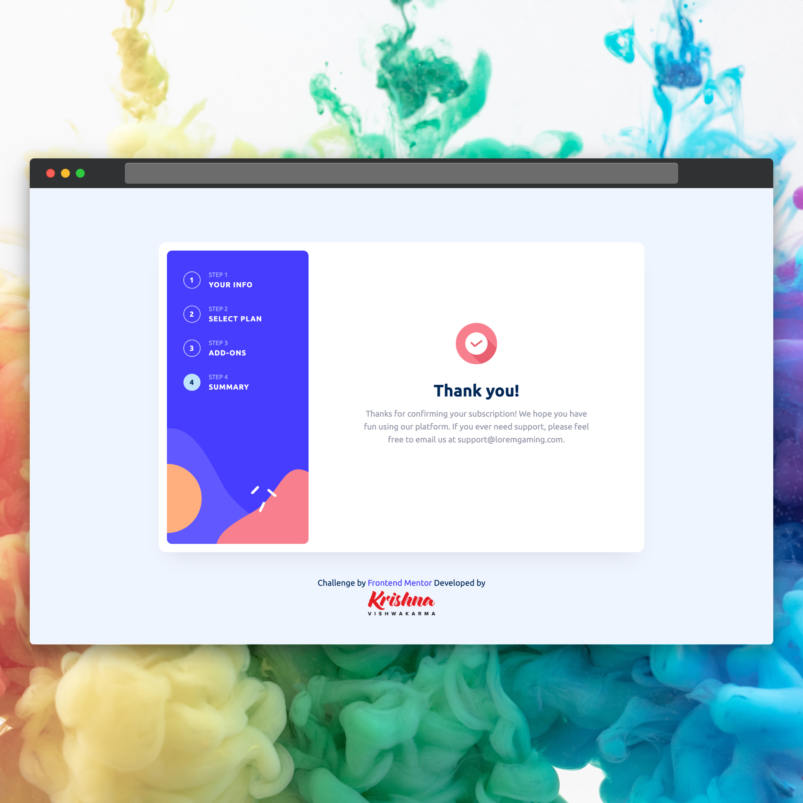
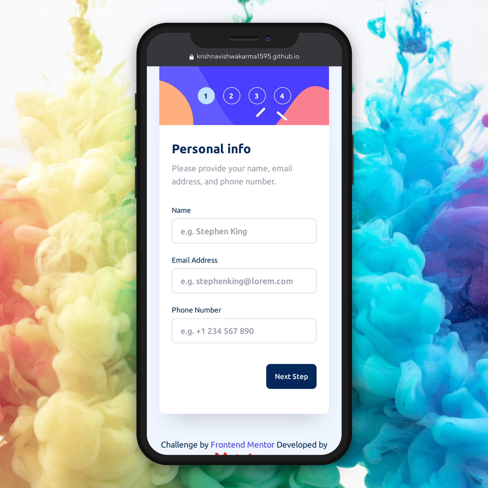

# Frontend Mentor - Multi-step form solution

This is a solution to the [Multi-step form challenge on Frontend Mentor](https://www.frontendmentor.io/challenges/multistep-form-YVAnSdqQBJ). Frontend Mentor challenges help you improve your coding skills by building realistic projects. 

## Welcome! 👋, Table of contents

- [Overview](#overview)
  - [The challenge](#the-challenge)
  - [Screenshot](#screenshot)
  - [Links](#links)
- [My process](#my-process)
  - [Built with](#built-with)
  - [What I learned](#what-i-learned)  
- [Author](#author)

## Overview

### The challenge

Users should be able to:

- Complete each step of the sequence
- Go back to a previous step to update their selections
- See a summary of their selections on the final step and confirm their order
- View the optimal layout for the interface depending on their device's screen size
- See hover and focus states for all interactive elements on the page
- Receive form validation messages if:
  - A field has been missed
  - The email address is not formatted correctly
  - A step is submitted, but no selection has been made

### Screenshot

### Links

- Solution URL: [Solution URL](https://www.frontendmentor.io/solutions/responsive-multistep-form-with-semantic-html-and-js-oops-concept-0LkI-ScOX4)
- Live Site URL: [Live URL](https://krishnavishwakarma1595.github.io/frontend-mentor/Advanced/multi-step-form/)

## My process

### Built with

- Semantic HTML5 markup
- CSS custom properties
- CSS Flexbox
- CSS Grid
- Mobile-first workflow
- Form Validation & Handling
- Javascripts DOM Manipulation
- Javascripts OOPS Concepts

### What I learned

The main learning for me here is to writing semantic HTML5 markup with HTML accessibility, CSS Grid and flexboxes and Javascript DOM manipulation and using OOPS concepts.

## Author

- Frontend Mentor - [@KrishnaVishwakarma1595](https://www.frontendmentor.io/profile/KrishnaVishwakarma1595)
- Codewars - [@krish_codewars_797](https://www.codewars.com/users/krish_codewars_797)