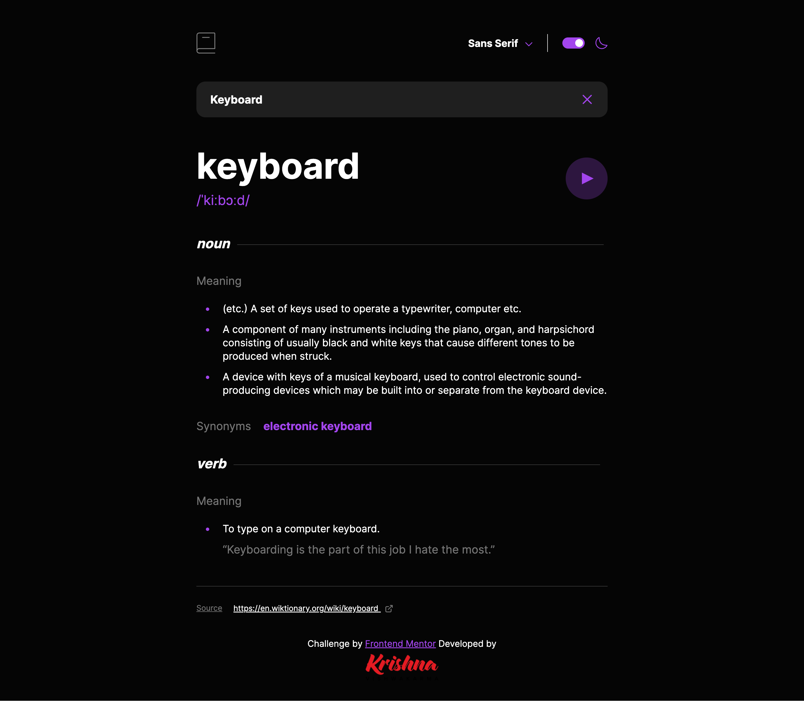

# Frontend Mentor - Dictionary web app solution

This is a solution to the [Dictionary web app challenge on Frontend Mentor](https://www.frontendmentor.io/challenges/dictionary-web-app-h5wwnyuKFL). Frontend Mentor challenges help you improve your coding skills by building realistic projects.

## Welcome! 👋, Table of contents

- [Overview](#overview)
  - [The challenge](#the-challenge)
  - [Screenshot](#screenshot)
  - [Links](#links)
- [My process](#my-process)
  - [Built with](#built-with)
  - [What I learned](#what-i-learned)  
- [Author](#author)

## Overview

### The challenge

Users can be able to:

- Search for words using the input field
- See the Free Dictionary API's response for the searched word
- See a form validation message when trying to submit a blank form
- Can listen the audio file for a word when it's available
- Switch between serif, sans serif, and monospace fonts
- Switch between light and dark themes
- View the optimal layout for the interface depending on their device's screen size
- See hover and focus states for all interactive elements on the page
- **Bonus**: As per their computer preferences of color scheme they will have default theme automatically activated.

### Screenshot

### Links

- Solution URL: [Solution URL](https://www.frontendmentor.io/solutions/responsive-theme-based-dictionary-web-app-using-bootstrap-and-js-oops-WZDs4P-3O6)
- Live Site URL: [Live URL](https://krishnavishwakarma1595.github.io/frontend-mentor/Intermediate/dictionary-web-app/)

## My process

### Built with

- Semantic HTML5 markup
- CSS custom properties
- CSS Flexbox
- CSS Grid
- Mobile-first workflow
- Form Validation & Handling
- Javascripts DOM Manipulation
- Javascripts OOPS Concepts
- Browser Localstorage to store user theme & font style preferences
- Third party API Integration

### What I learned

The main learning for me here is to writing semantic HTML5 markup with HTML accessibility, CSS Grid and flexboxes and Javascript DOM manipulation and using OOPS concepts & third party Dictionary API integration.

## Author

- Frontend Mentor - [@KrishnaVishwakarma1595](https://www.frontendmentor.io/profile/KrishnaVishwakarma1595)
- Codewars - [@krish_codewars_797](https://www.codewars.com/users/krish_codewars_797)