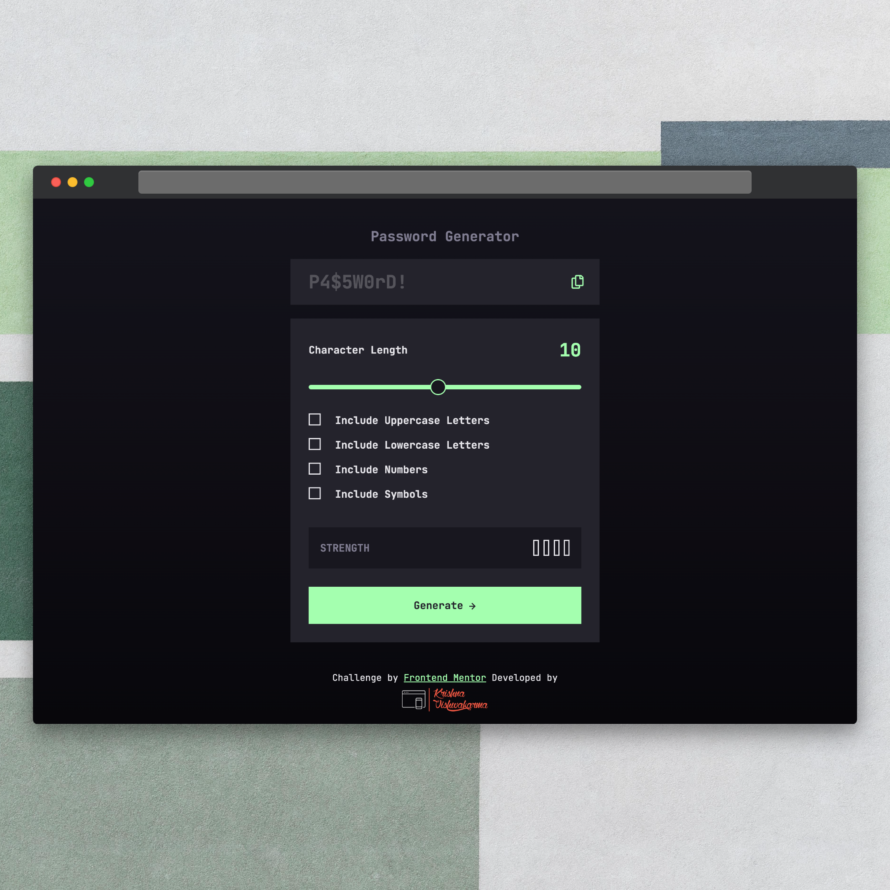
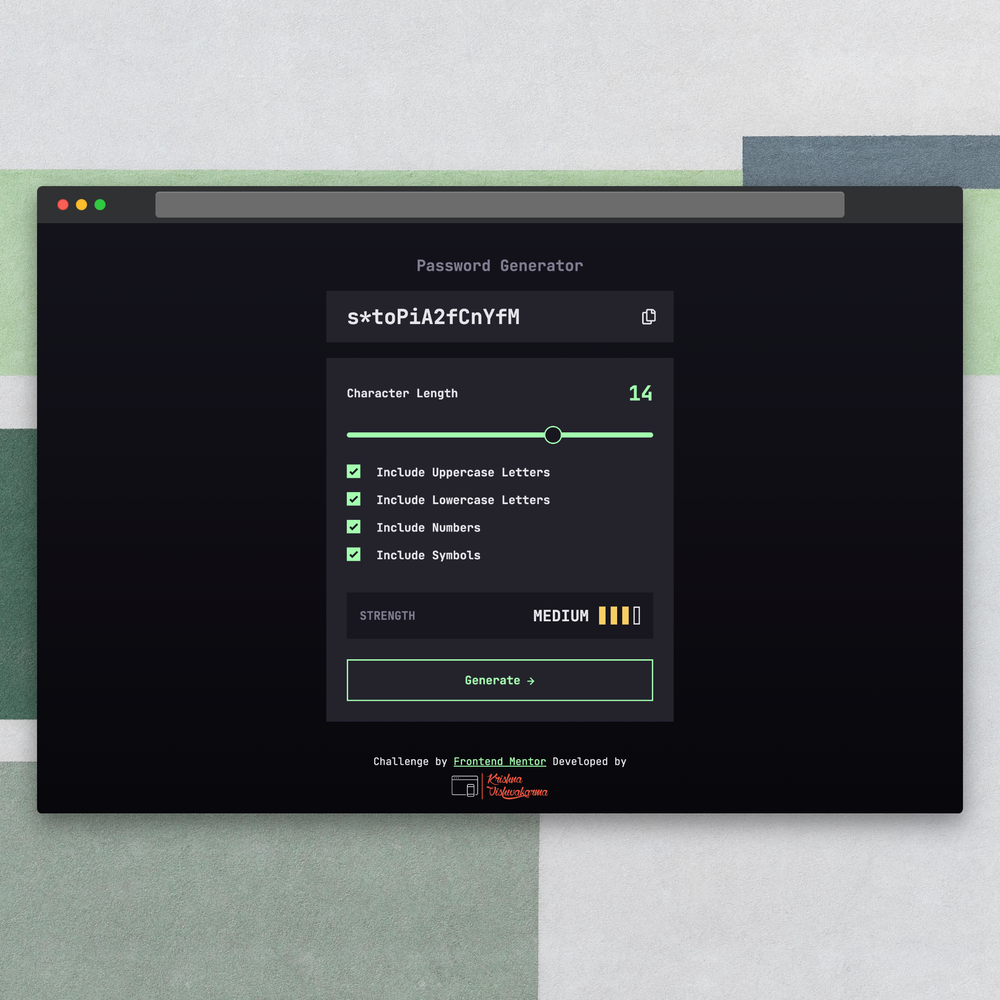

# Frontend Mentor - Password generator app solution

This is a solution to the [Password generator app challenge on Frontend Mentor](https://www.frontendmentor.io/challenges/password-generator-app-Mr8CLycqjh). Frontend Mentor challenges help you improve your coding skills by building realistic projects. 

## Welcome! 👋, Table of contents

- [Overview](#overview)
  - [The challenge](#the-challenge)
  - [Screenshot](#screenshot)
  - [Links](#links)
- [My process](#my-process)
  - [Built with](#built-with)
  - [What I learned](#what-i-learned)  
- [Author](#author)

## Overview

### The challenge

Users can be able to:

- Generate a password based on the selected inclusion options
- Copy the generated password to the computer's clipboard
- See a strength rating for their generated password
- View the optimal layout for the interface depending on their device's screen size
- See hover and focus states for all interactive elements on the page

### Screenshot

### Links

- Solution URL: [Solution URL](https://www.frontendmentor.io/solutions/responsive-password-generator-app-using-css-flexboxes-and-javascript-mEP0y5zldc)
- Live Site URL: [Live URL](https://krishnavishwakarma1595.github.io/frontend-mentor/Intermediate/password-generator-app/)

## My process

### Built with

- Semantic HTML5 markup
- CSS custom properties
- CSS Flexbox
- Mobile-first workflow
- Javascripts DOM Manipulation
- Javascripts OOPS Concepts

### What I learned

The main learning for me here is to writing semantic HTML5 markup with HTML accessibility, CSS Flexboxes and Javascript DOM manipulation and using OOPS concepts.

## Author

- Frontend Mentor - [@KrishnaVishwakarma1595](https://www.frontendmentor.io/profile/KrishnaVishwakarma1595)
- Codewars - [@krish_codewars_797](https://www.codewars.com/users/krish_codewars_797)