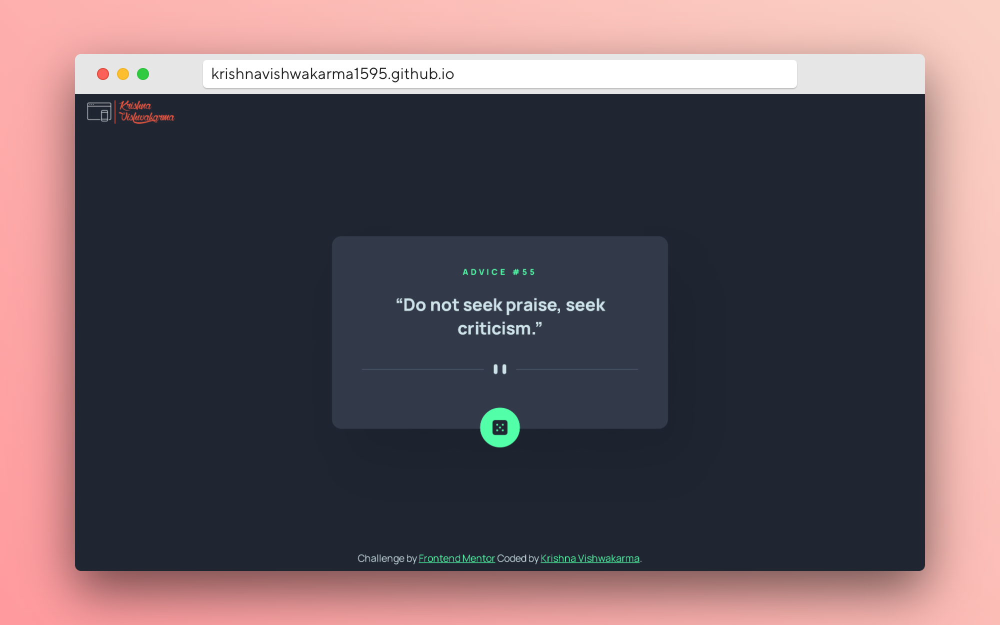
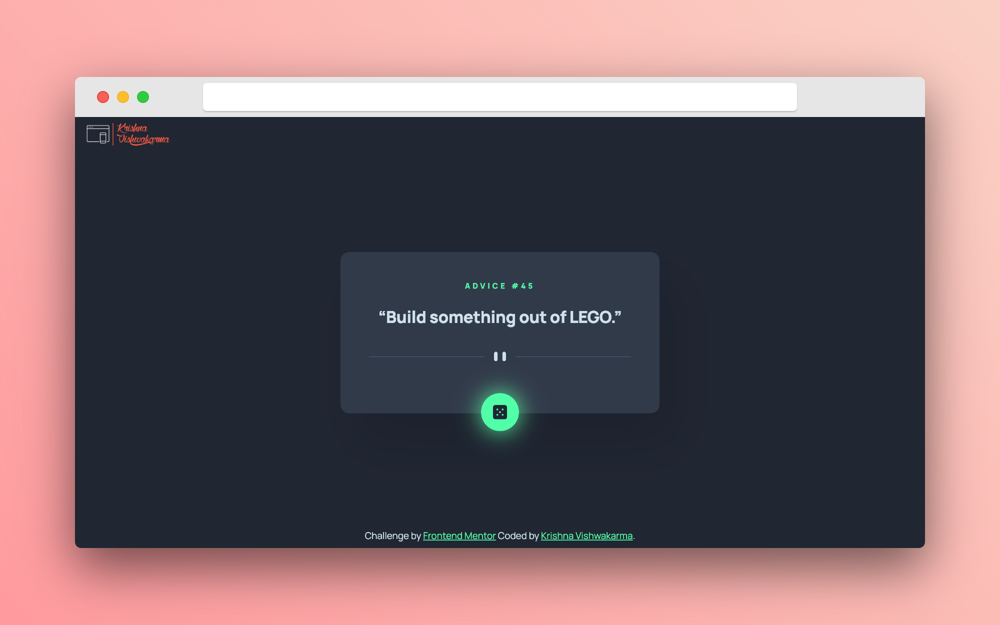
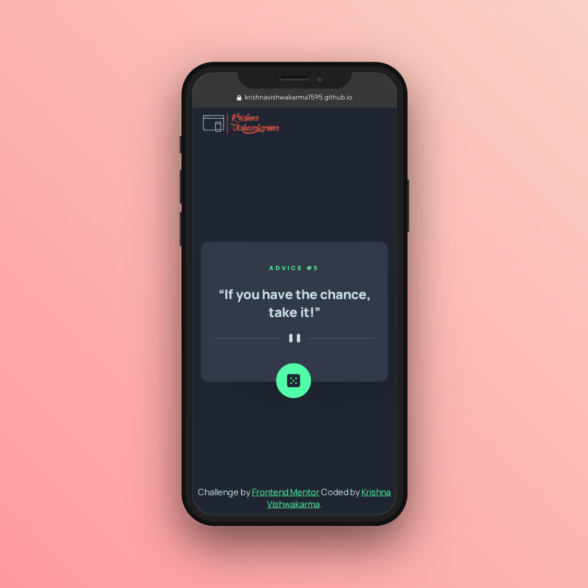

# Frontend Mentor - Advice generator app solution

This is a solution to the [Advice generator app challenge on Frontend Mentor](https://www.frontendmentor.io/challenges/advice-generator-app-QdUG-13db). Frontend Mentor challenges help you improve your coding skills by building realistic projects.

## Table of contents

- [Overview](#overview)
  - [Screenshot](#screenshot)
  - [Links](#links)
- [My process](#my-process)
  - [Built with](#built-with)
  - [What I learned](#what-i-learned)  
- [Author](#author)

## Overview

### Screenshot

### Links

- Solution URL: [Solution URL](https://www.frontendmentor.io/solutions/responsive-advice-generator-app-using-fetch-api-and-oop-concepts-of-js-DUOMf2oKNS)
- Live Site URL: [Live URL](https://krishnavishwakarma1595.github.io/frontend-mentor/Junior/advice-generator-app/)

## My process

### Built with

- Semantic HTML5 markup
- CSS custom properties
- CSS Flexbox
- CSS Grid
- Mobile-first workflow
- Javascripts DOM Manipulation
- Javascripts OOPS Concepts
- Third Parti API call using default Fetch API

### What I learned

The main learning for me here is to writing semantic HTML5 markup with HTML accessibility, CSS Grid and flexboxes and Javascript DOM manipulation using OOPS concepts & calling a 3rd parth API using javascript's default fetch API method.

## Author

- Frontend Mentor - [@KrishnaVishwakarma1595](https://www.frontendmentor.io/profile/KrishnaVishwakarma1595)
- Codewars - [@krish_codewars_797](https://www.codewars.com/users/krish_codewars_797)