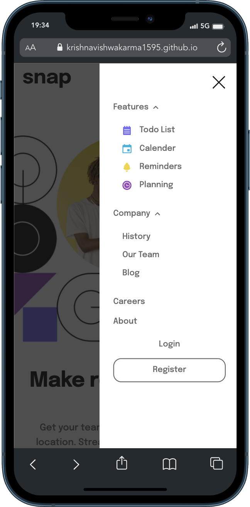

# Frontend Mentor - Intro section with dropdown navigation solution

This is a solution to the [Intro section with dropdown navigation challenge on Frontend Mentor](https://www.frontendmentor.io/challenges/intro-section-with-dropdown-navigation-ryaPetHE5). Frontend Mentor challenges help you improve your coding skills by building realistic projects. 

## Table of contents

- [Overview](#overview)
  - [Screenshot](#screenshot)
  - [Links](#links)
- [My process](#my-process)
  - [Built with](#built-with)
  - [What I learned](#what-i-learned)  
- [Author](#author)

## Overview

### Screenshot

### Links

- Solution URL: [Solution URL](https://www.frontendmentor.io/solutions/responsive-intro-section-with-dropdown-navigation-using-bootstrap-c7zpAg3H55)
- Live Site URL: [Live URL](https://krishnavishwakarma1595.github.io/frontend-mentor/Junior/intro-section-with-dropdown-navigation/)

## My process

### Built with

- Semantic HTML5 markup
- CSS custom properties
- CSS Flexbox
- CSS Grid
- Bootstrap
- Mobile-first workflow
- Javascripts DOM Manipulation

### What I learned

- Writing semantic HTML5 markup with HTML accessibility
- Working with CSS Grid & Flexbox
- Mobile/Desktop first workflow
- Bootstrap CSS Framework
- Animating elements

## Author

- Frontend Mentor - [@KrishnaVishwakarma1595](https://www.frontendmentor.io/profile/KrishnaVishwakarma1595)
- Codewars - [@krish_codewars_797](https://www.codewars.com/users/krish_codewars_797)