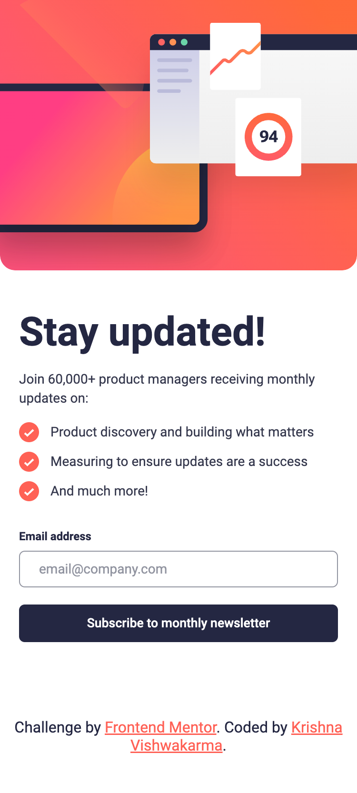

# Frontend Mentor - Newsletter sign-up form with success message

This is a solution to the [Newsletter sign-up form with success message challenge on Frontend Mentor](https://www.frontendmentor.io/challenges/newsletter-signup-form-with-success-message-3FC1AZbNrv). Frontend Mentor challenges help you improve your coding skills by building realistic projects. 

## Table of contents

- [Overview](#overview)
  - [Screenshots](#screenshots)
  - [Links](#links)
- [My process](#my-process)
  - [Built with](#built-with)
  - [What I learned](#what-i-learned)  
- [Author](#author)

## Overview

### Screenshots

### Links

- Solution URL: [Solution URL](https://www.frontendmentor.io/solutions/responsive-newsletter-signup-with-success-message-8G-kTL0510)
- Live Site URL: [Live URL](https://krishnavishwakarma1595.github.io/frontend-mentor/Junior/newsletter-sign-up-with-success-message-main/)

## My process

### Built with

- Semantic HTML5 markup
- CSS custom properties
- CSS Flexbox
- CSS Grid
- HTML Forms
- Form Error Handling
- Mobile-first workflow
- Javascript interection with DOM

### What I learned

The main learning for me here is to writing semantic HTML5 markup with HTML accessibility, HTML Forms and input fields & Javascript interection with DOM.

## Author

- Frontend Mentor - [@KrishnaVishwakarma1595](https://www.frontendmentor.io/profile/KrishnaVishwakarma1595)
- Codewars - [@krish_codewars_797](https://www.codewars.com/users/krish_codewars_797)