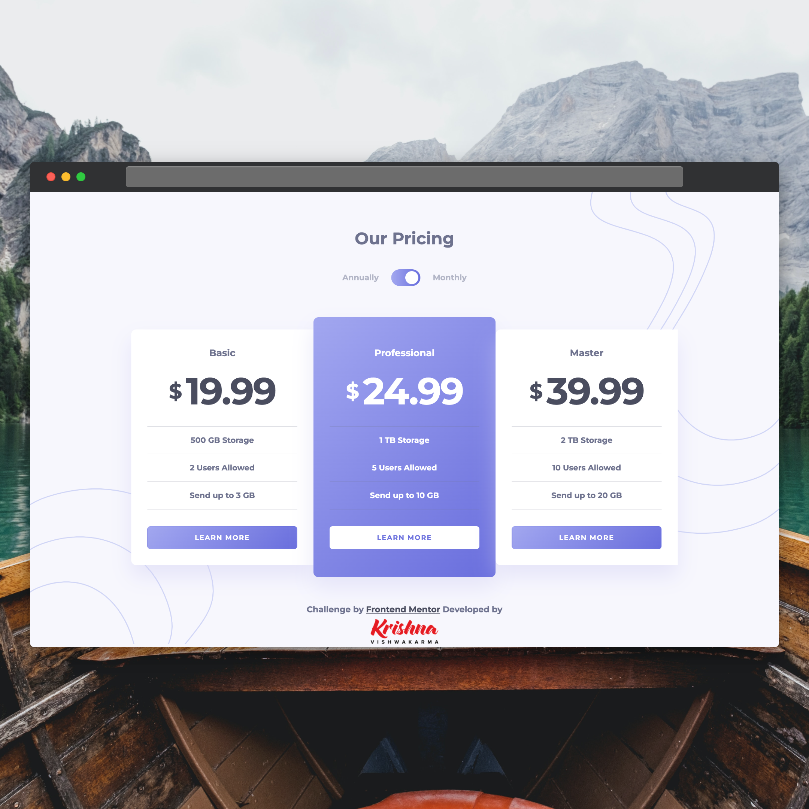
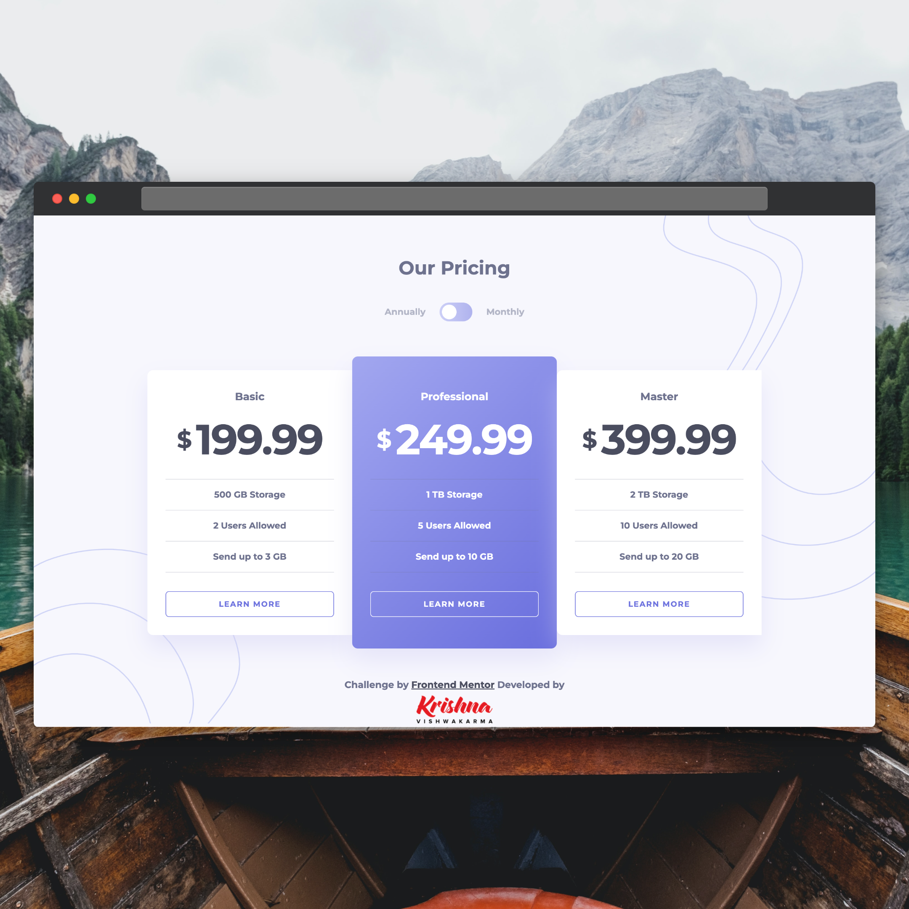

# Frontend Mentor - Pricing component with toggle solution

This is a solution to the [Pricing component with toggle challenge on Frontend Mentor](https://www.frontendmentor.io/challenges/pricing-component-with-toggle-8vPwRMIC). Frontend Mentor challenges help you improve your coding skills by building realistic projects.  

## Welcome! 👋, Table of contents

- [Overview](#overview)
  - [The challenge](#the-challenge)
  - [Screenshot](#screenshot)
  - [Links](#links)
- [My process](#my-process)
  - [Built with](#built-with)
  - [What I learned](#what-i-learned)  
- [Author](#author)

## Overview

### The challenge

Users should be able to:

- View the optimal layout for the component depending on their device's screen size
- Control the toggle with both their mouse/trackpad and their keyboard

### Screenshot

### Links

- Solution URL: [Solution URL](https://www.frontendmentor.io/solutions/responsive-news-homepage-using-css-grids-and-flexboxes-pwOhovhwl5)
- Live Site URL: [Live URL](https://krishnavishwakarma1595.github.io/frontend-mentor/Junior/news-homepage/)

## My process

### Built with

- Semantic HTML5 markup
- CSS Flexbox
- CSS Grid
- Mobile-first workflow

### What I learned

The main learning for me here is to writing semantic HTML5 markup with HTML accessibility, CSS Grid and flexboxes.

## Author

- Frontend Mentor - [@KrishnaVishwakarma1595](https://www.frontendmentor.io/profile/KrishnaVishwakarma1595)
- Codewars - [@krish_codewars_797](https://www.codewars.com/users/krish_codewars_797)