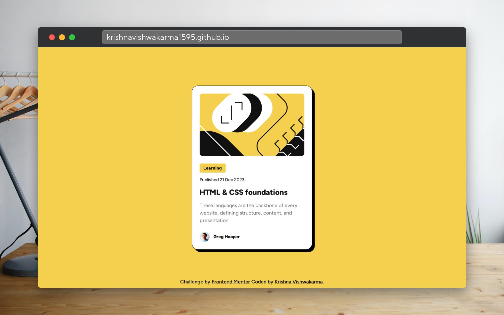
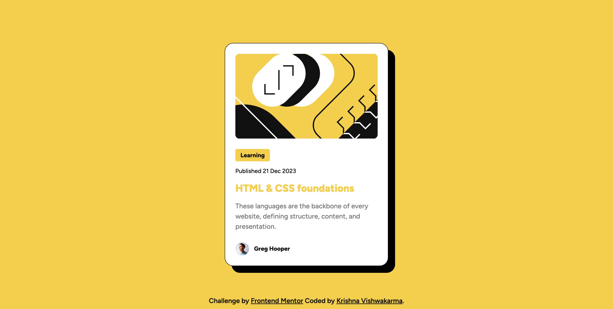
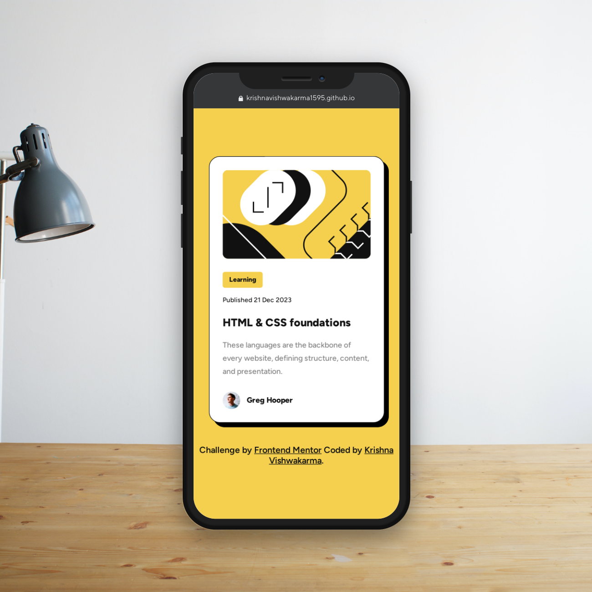

# Frontend Mentor - Blog preview card solution

This is a solution to the [Blog preview card challenge on Frontend Mentor](https://www.frontendmentor.io/challenges/blog-preview-card-ckPaj01IcS). Frontend Mentor challenges help you improve your coding skills by building realistic projects.  

## Table of contents

- [Overview](#overview)
  - [The challenge](#the-challenge)
  - [Screenshots](#screenshots)
  - [Links](#links)
- [My process](#my-process)
  - [Built with](#built-with)
  - [What I learned](#what-i-learned)  
- [Author](#author)

## Overview

### The challenge

Users should be able to:

- See hover and focus states for all interactive elements on the page

### Screenshots

### Links

- Solution URL: [Solution URL](https://www.frontendmentor.io/solutions/responsive-blog-preview-card-M8t8R4o64s)
- Live Site URL: [Live URL](https://krishnavishwakarma1595.github.io/frontend-mentor/Newbie/blog-preview-card/)

## My process

### Built with

- Semantic HTML5 markup
- CSS Flexbox
- Mobile-first workflow

### What I learned

The main learning for me here is to writing semantic HTML5 markup with HTML accessibility.

## Author

- Frontend Mentor - [@KrishnaVishwakarma1595](https://www.frontendmentor.io/profile/KrishnaVishwakarma1595)
- Codewars - [@krish_codewars_797](https://www.codewars.com/users/krish_codewars_797)