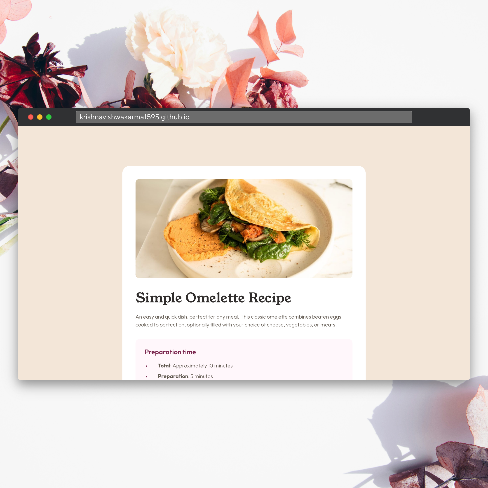
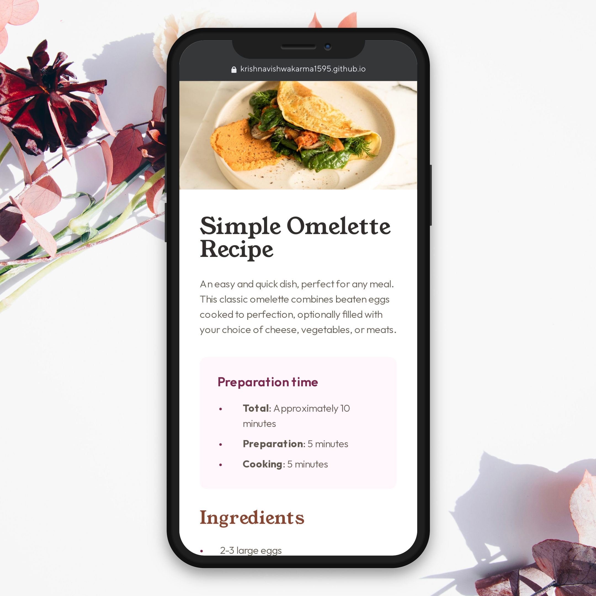

# Frontend Mentor - Recipe page solution

This is a solution to the [Recipe page challenge on Frontend Mentor](https://www.frontendmentor.io/challenges/recipe-page-KiTsR8QQKm). Frontend Mentor challenges help you improve your coding skills by building realistic projects.

## Welcome! 👋, Table of contents

- [Overview](#overview)  
  - [Screenshot](#screenshot)
  - [Links](#links)
- [My process](#my-process)
  - [Built with](#built-with)
  - [What I learned](#what-i-learned)  
- [Author](#author)

## Overview

### Screenshot

### Links

- Solution URL: [Solution URL](https://www.frontendmentor.io/solutions/responsive-social-links-profile-component-WhVn3D3wwL)
- Live Site URL: [Live URL](https://krishnavishwakarma1595.github.io/frontend-mentor/Newbie/social-links-profile/)

## My process

### Built with

- Semantic HTML5 markup
- CSS custom properties
- CSS Flexbox & Grid
- Mobile-first workflow

### What I learned

- Writing Semantic HTML5 markup
- CSS Flexbox & Grids
- Mobile-first workflow

## Author

- Frontend Mentor - [@KrishnaVishwakarma1595](https://www.frontendmentor.io/profile/KrishnaVishwakarma1595)
- Codewars - [@krish_codewars_797](https://www.codewars.com/users/krish_codewars_797)
