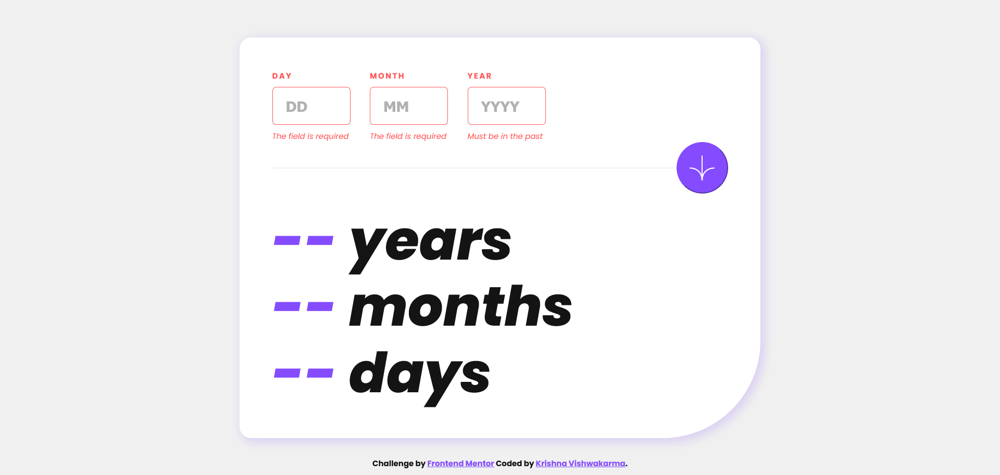
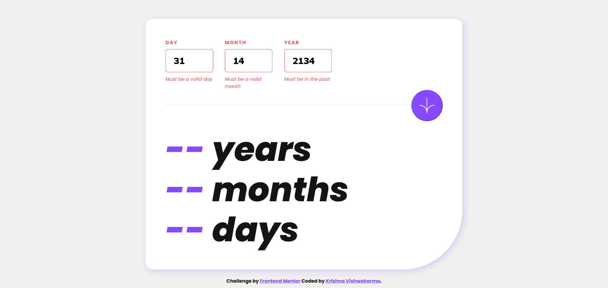
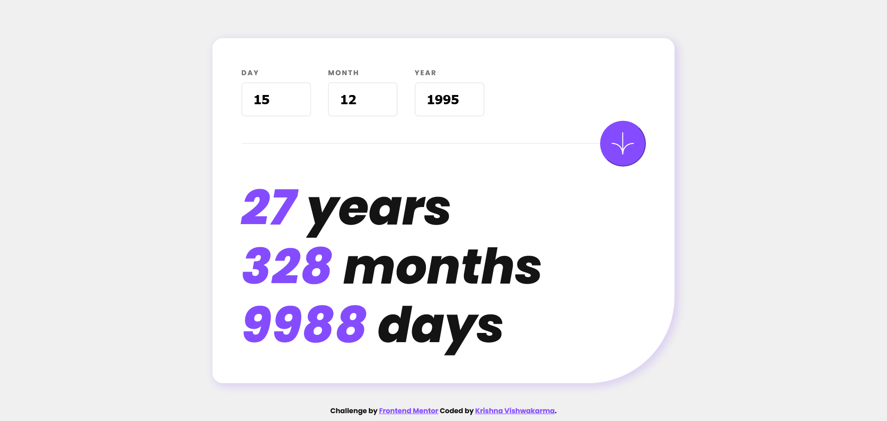
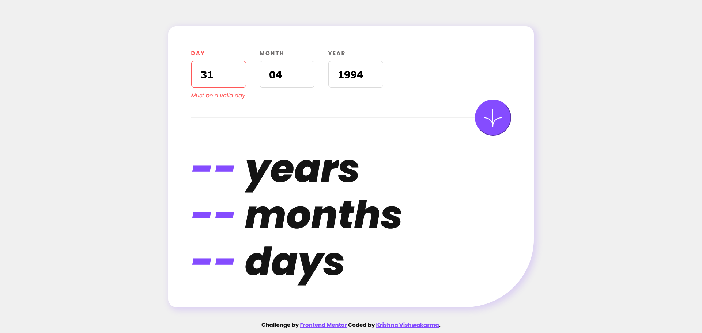
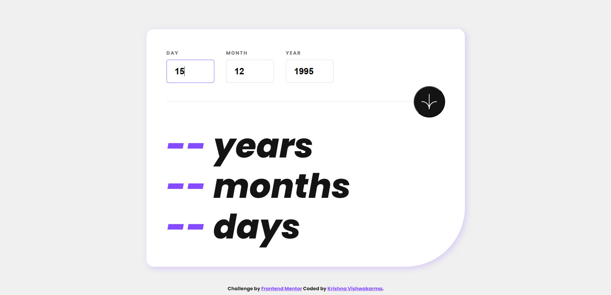

# Frontend Mentor - Age calculator app solution

This is a solution to the [Age calculator app challenge on Frontend Mentor](https://www.frontendmentor.io/challenges/age-calculator-app-dF9DFFpj-Q). Frontend Mentor challenges help you improve your coding skills by building realistic projects. 

## Table of contents

- [Overview](#overview)
  - [Screenshots](#screenshots)
  - [Links](#links)
- [My process](#my-process)
  - [Built with](#built-with)
  - [What I learned](#what-i-learned)  
- [Author](#author)

## Overview

### Screenshots

### Links

- Solution URL: [Solution URL](https://github.com/KrishnaVishwakarma1595/interactive-card-details-form)
- Live Site URL: [Live URL](https://krishnavishwakarma1595.github.io/interactive-card-details-form/)

## My process

### Built with

- Semantic HTML5 markup
- CSS custom properties
- CSS Flexbox
- CSS Grid
- HTML Forms
- Form Error Handling
- Mobile-first workflow
- Javascript interection with DOM

### What I learned

- Writing semantic HTML5 markup with HTML accessibility
- HTML Forms and input fields
- Form Error Handling 
- Javascript interection with DOM
- Working with Javascript dates

## Author

- Frontend Mentor - [@KrishnaVishwakarma1595](https://www.frontendmentor.io/profile/KrishnaVishwakarma1595)
- Codewars - [@krish_codewars_797](https://www.codewars.com/users/krish_codewars_797)